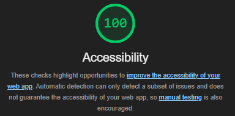
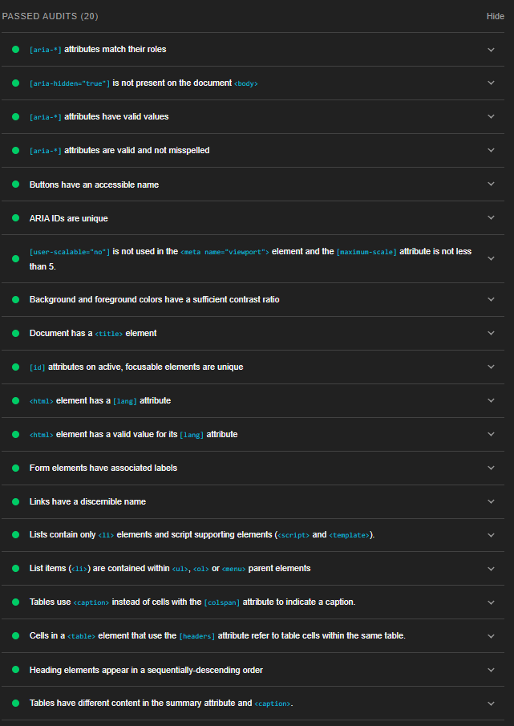

# Spotilist Web Project

Spotilist is a web-based application designed to elevate your music experience. It allows you to effortlessly browse through a wide range of songs from iTunes and add your favorites to a personalized list.

## Frontend Application Tasks – Web Engineering

This project is a submission by Leo Bowen Wang for the Frontend Application Tasks in Web Engineering.

### General Requirements

- [x] Responsive page content
- [x] No Javascript Frameworks/Libraries used
- [x] Clear and consistent project structure
- [x] Separate resource files
- [x] WAI compliant: Verified through Lighthouse analysis for accessibility

### Project Setup and Build Management

- [x] Built with `npm` and Vite as the build and dependency management tool
- [x] Defined tasks for Development and Production build in npm scripts
- [x] Configured to use TypeScript with `tsconfig.json`

### Multiple Pages

- [x] Implemented a single-page that dynamically reloads content for proper navigation

### API Consumption using Ajax

- [x] API data consumed using native TypeScript methods

### DOM Manipulation

- [x] Used DOM API for dynamic UI manipulation

### Form Implementation

- [x] HTML5 forms with fields: text, number, password, email
- [x] Input validation on user events using TypeScript

### CI/CD Pipeline

- [x] Includes unit tests with Vitest
- [x] Configured linting with ESLint
- [x] GitHub Actions for CI/CD

## Lighthouse Accessibility Compliance

The project is compliant with Web Accessibility standards as verified by Lighthouse analysis.

